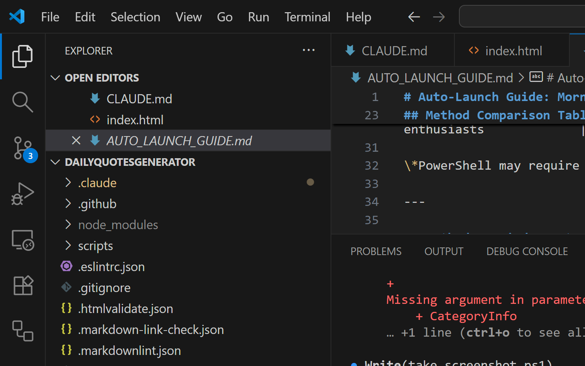

# Morning Motivation Quote Generator

> Start your day with inspiration. A simple, elegant web app that displays motivational quotes when you log into your computer.

[](https://opensource.org/licenses/MIT)
[](http://makeapullrequest.com)

## Overview

**Morning Motivation Quote Generator** is a lightweight, open-source web application that displays inspiring quotes about learning, growth, and persistence when you log into your computer. It's designed to foster a positive, motivated mindset at the start of your day.

### Key Features

#### Core Features

- **Random Motivational Quotes** - Fetches fresh, inspiring quotes from a curated API
- **Clean Corner Pop-up** - Minimal, professional design that doesn't interrupt your workflow
- **Smart Auto-close** - Disappears after 15 seconds (configurable 5-60s)
- **Hover to Keep** - Pause the timer by hovering over the quote
- **Click to Learn More** - Click the quote to search or explore its source
- **Offline Support** - Works without internet using fallback quotes
- **Auto-launch** - Opens automatically on system login
- **Zero Dependencies** - Pure HTML, CSS, and JavaScript

#### V2 Features (New!)

- **🌙 Dark/Light Mode** - Toggle between themes or auto-detect system preference
- **⚙️ Customization Panel** - Adjust timer, position, font size, and more
- **📚 Quote Categories** - Filter by Motivation, Learning, Creativity, or Productivity
- **💾 Persistent Settings** - All preferences saved locally

## Demo



_A clean, minimal notification displaying an inspiring quote in the bottom-right corner of your screen._

## Quick Start

### Installation

1. **Download the repository:**

   ```bash
   git clone https://github.com/sebastian-ames3/dailyQuotesGenerator.git
   cd dailyQuotesGenerator
   ```

   Or download as ZIP from GitHub and extract to your preferred location.

2. **Install Python dependencies (required for frameless overlay):**

   ```bash
   pip install -r requirements.txt
   ```

   **Note:** If you don't have Python installed, the tool will automatically fall back to using your web browser (index.html).

3. **Test the quote generator:**

   ```bash
   # Method 1: Python overlay (recommended)
   python quote_overlay.py

   # Method 2: Browser fallback
   # Windows: start index.html
   # Mac: open index.html
   # Linux: xdg-open index.html
   ```

4. **Set up auto-launch** (optional):
   - **Windows:** Double-click `install_scheduled_quotes.bat` (one-click installation)
   - **Other platforms:** See [SETUP.md](SETUP.md) for detailed instructions

## Configuration

### V2 Settings Panel (Recommended)

Click the ⚙️ settings button in the quote notification to customize:

- **Timer Duration**: 5-60 seconds (slider)
- **Position**: Bottom-right, bottom-left, top-right, or top-left
- **Font Size**: Small, medium, or large
- **Quote Category**: Motivation, Learning, Creativity, Productivity, or All
- **Theme**: Toggle 🌙 dark mode / ☀️ light mode

All settings are saved automatically and persist between sessions.

### Manual Configuration (Advanced)

You can also customize by editing `index.html`:

**Change Auto-Close Timer**

```javascript
const config = {
  timerDuration: 15000, // 15 seconds (in milliseconds)
  ...
};
```

**Change Quote Position**

```css
/* Default: bottom-right */
bottom: 24px;
right: 24px;
```

## Auto-Launch Setup

### Quick Setup (Windows 10/11)

1. **Test the batch file:**

   ```bash
   # Double-click LaunchQuote.bat to test
   ```

2. **Add to Windows Startup:**
   - Press `Windows + R`
   - Type: `shell:startup`
   - Press Enter
   - Create a shortcut to `LaunchQuote.bat` in this folder
   - Optional: Right-click shortcut → Properties → Run: **Minimized**

3. **Test:** Log out and log back in - the quote should appear automatically!

### Detailed Instructions

For comprehensive setup guides including:

- **Windows:** Startup Folder, Task Scheduler, Registry, PowerShell
- **macOS:** LaunchAgents and Login Items
- **Linux:** XDG Autostart (GNOME, KDE, XFCE)
- **Troubleshooting** and customization options

See **[SETUP.md](SETUP.md)** for quick start or **[AUTO_LAUNCH_GUIDE.md](AUTO_LAUNCH_GUIDE.md)** for the complete guide.

## Development

This project is actively developed with a focus on simplicity and user experience.

### Project Structure

```
dailyQuotesGenerator/
├── index.html                # Main application
├── LaunchQuote.bat           # Auto-launch batch file (Windows)
├── README.md                 # This file
├── SETUP.md                  # Quick setup guide
├── AUTO_LAUNCH_GUIDE.md      # Comprehensive auto-launch guide
├── PRD.md                    # Product Requirements Document
├── CLAUDE.md                 # Development guide
├── CHANGELOG.md              # Version history
├── LICENSE                   # MIT License
├── API_RESEARCH_REPORT.md    # Quote API research
├── UX_RESEARCH_REPORT.md     # UX/UI research
├── CURATED_QUOTES.md         # Fallback quotes collection
├── DESIGN_AB_TEST.md         # Design variations research
└── .gitignore                # Git ignore rules
```

### Built With

- **HTML5** - Structure
- **CSS3** - Styling and animations
- **JavaScript (ES6+)** - Logic and API integration
- **DummyJSON Quotes API** - Primary quote source
- **Curated Fallback Quotes** - Offline support

### Development Workflow

We use a structured development process:

1. **Feature branches** - All work done on dedicated branches
2. **Pull Requests** - All changes reviewed via PRs
3. **Documentation** - CHANGELOG.md updated for every change
4. **Sub-agents** - AI agents used for research and design decisions

See [CLAUDE.md](CLAUDE.md) for detailed development guidelines.

## Contributing

Contributions are welcome! Whether it's bug fixes, new features, or improvements to documentation.

### How to Contribute

1. Fork the repository
2. Create a feature branch (`git checkout -b feature/amazing-feature`)
3. Commit your changes (`git commit -m 'Add some amazing feature'`)
4. Push to the branch (`git push origin feature/amazing-feature`)
5. Open a Pull Request

Please read [PRD.md](PRD.md) for details on our product requirements and [CLAUDE.md](CLAUDE.md) for development guidelines.

## Roadmap

### V1 (Complete - v1.0.0)

- [x] Project setup and documentation
- [x] API research and selection (DummyJSON)
- [x] Core HTML/CSS/JS implementation
- [x] Python frameless overlay (quote_overlay.py)
- [x] Modern Gradient design (Design B)
- [x] Offline fallback quotes (15 curated quotes)
- [x] Smart quote filtering (motivational/inspirational only)
- [x] Text normalization (fixes all capitalization issues)
- [x] Auto-launch installation scripts (Windows)
- [x] Auto-launch instructions (Windows/macOS/Linux)
- [x] Accessibility (WCAG 2.1 AA)
- [x] CI/CD pipeline (8 quality checks)
- [x] Screenshot/demo for README
- [x] v1.0.0 release

### V2 (Complete - v2.0.0)

- [x] Critical bug fixes (text normalization, punctuation handling)
- [x] Dark/light mode with auto-detection
- [x] Settings panel with live customization
- [x] Timer duration control (5-60s)
- [x] Position customization (4 corners)
- [x] Font size options (S/M/L)
- [x] Quote categories (Motivation, Learning, Creativity, Productivity)
- [x] Smart category filtering
- [x] Persistent user preferences (localStorage)
- [x] v2.0.0 release

### V3 (Future)

- [ ] Python overlay V2 updates (dark mode, settings)
- [ ] Quote sharing (social media, clipboard)
- [ ] Custom quote collections
- [ ] Multi-language support
- [ ] Browser extension version
- [ ] Mobile app version

See the [CHANGELOG.md](CHANGELOG.md) for a detailed version history.

## License

This project is licensed under the MIT License - see the [LICENSE](LICENSE) file for details.

## Acknowledgments

- [DummyJSON](https://dummyjson.com/) for the free quotes API
- Inspired by the desire to start each day with purpose and motivation
- Built with Claude Code for efficient AI-assisted development
- Research conducted by 5 specialized AI sub-agents for optimal design and implementation

## Support

Found a bug? Have a suggestion?

- **Issues:** [GitHub Issues](https://github.com/sebastian-ames3/dailyQuotesGenerator/issues)

---

**Start your day inspired.** ⭐ Star this repo if you find it helpful!
